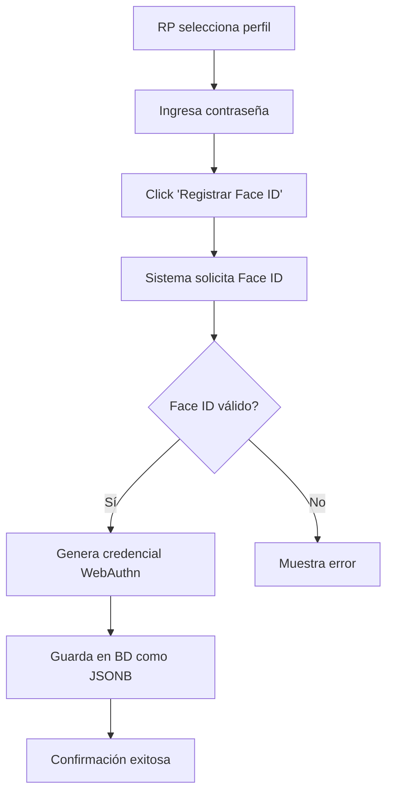
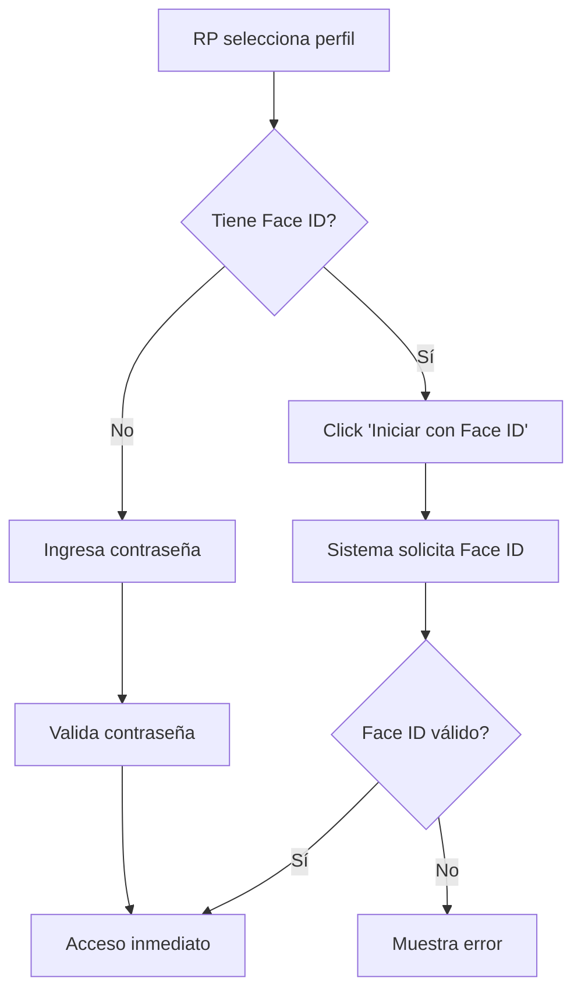

# Sistema de Autenticación Biométrica para RPs

## 🎯 Descripción General

Sistema completo de autenticación biométrica que permite a los RPs iniciar sesión usando **Face ID** o **Touch ID** de sus iPhones, eliminando la necesidad de recordar contraseñas.

## 🔐 Tecnología Utilizada

### Web Authentication API (WebAuthn)
- **Estándar W3C** para autenticación segura en la web
- **FIDO2** compatible
- Soportado nativamente por iOS Safari 14+
- Las credenciales biométricas **nunca salen del dispositivo**
- Solo se almacena la **clave pública** en el servidor

### Características de Seguridad
- ✅ Autenticación sin contraseña (Passwordless)
- ✅ Resistente a phishing
- ✅ No requiere almacenar datos biométricos
- ✅ Validación local en el dispositivo
- ✅ Cifrado de extremo a extremo

## 📱 Compatibilidad

### Dispositivos Soportados
- **iPhone** con Face ID (iPhone X y posteriores)
- **iPhone/iPad** con Touch ID
- **iOS 14+** requerido
- **Safari 14+** o **Chrome iOS 108+**

### Requisitos
- ✅ HTTPS obligatorio (excepto localhost para desarrollo)
- ✅ Face ID o Touch ID configurado en el dispositivo
- ✅ Permisos de autenticación biométrica habilitados

## 🏗️ Arquitectura del Sistema

### Componentes Creados

#### 1. BiometricAuth Component
**Ubicación:** `/components/BiometricAuth.tsx`

**Props:**
```typescript
interface BiometricAuthProps {
  rpId: string              // ID del RP en la base de datos
  rpNombre: string          // Nombre del RP para display
  onSuccess: () => void     // Callback cuando la auth es exitosa
  onError: (error: string) => void  // Callback para errores
  mode: 'register' | 'login'  // Modo de operación
}
```

**Funcionalidades:**
- Registro de credenciales biométricas
- Autenticación con Face ID/Touch ID
- Manejo de errores y estados
- UI animada con feedback visual
- Conversión de ArrayBuffer ↔ Base64

#### 2. Base de Datos
**Tabla:** `limites_cortesias_rp`

**Nuevas Columnas:**
```sql
biometric_credential JSONB           -- Credencial WebAuthn
biometric_enabled BOOLEAN            -- Estado de activación
biometric_registered_at TIMESTAMP    -- Fecha de registro
```

**Funciones SQL:**
- `registrar_biometric_rp()` - Registra credencial
- `desactivar_biometric_rp()` - Desactiva biométrica
- `vista_rps_biometric` - Vista de RPs con biométrica

#### 3. Página de Login
**Ubicación:** `/app/dashboard/rp-login/page.tsx`

**Flujos Implementados:**
1. **Registro de Face ID**
   - RP selecciona su perfil
   - Ingresa contraseña (primera vez)
   - Click en "Registrar Face ID"
   - Sistema solicita Face ID
   - Credencial se guarda en BD

2. **Login con Face ID**
   - RP selecciona su perfil
   - Click en "Iniciar con Face ID"
   - Sistema solicita Face ID
   - Acceso inmediato al dashboard

## 🔄 Flujo de Trabajo

### Registro Inicial (Primera Vez)



### Login Subsecuente



## 💾 Estructura de Datos

### Credencial Biométrica (JSONB)
```json
{
  "id": "AQIDBAUGBwgJCgsMDQ4PEBESExQVFhcYGRobHB0eHyA",
  "rawId": "AQIDBAUGBwgJCgsMDQ4PEBESExQVFhcYGRobHB0eHyA",
  "type": "public-key",
  "response": {
    "clientDataJSON": "eyJ0eXBlIjoid2ViYXV0aG4uY3JlYXRlIiwiY2hhbGxlbmdlIjoiYWJjZGVmZ2hpamtsbW5vcHFyc3R1dnd4eXoxMjM0NTY3ODkwIiwib3JpZ2luIjoiaHR0cHM6Ly9mZXZlcm14LnNpdGUifQ",
    "attestationObject": "o2NmbXRkbm9uZWdhdHRTdG10oGhhdXRoRGF0YVikSZYN5YgOjGh0NBcPZHZgW4_krrmihjLHmVzzuoMdl2NFAAAAAK3OAAI1vMYKZIsLJfHwVQMAIAECAwQFBgcICQoLDA0ODxAREhMUFRYXGBkaGxwdHh8gpQECAyYgASFYIJV6xJlsYSNkXxNnLWZhZGFzZGFzZGFzZGFzZGFzZGFzIlgg"
  }
}
```

### Campos en Base de Datos
```sql
-- Ejemplo de registro
INSERT INTO limites_cortesias_rp (
  rp_nombre,
  telefono,
  password,
  biometric_credential,
  biometric_enabled,
  biometric_registered_at
) VALUES (
  'Juan Pérez',
  '5551234567',
  'password123',
  '{"id":"ABC...","type":"public-key",...}',
  TRUE,
  NOW()
);
```

## 🎨 Interfaz de Usuario

### Estados Visuales

#### 1. Sin Face ID Registrado
```
┌─────────────────────────────────┐
│  [Contraseña Input]             │
│  [Iniciar Sesión]               │
│  ────────── O ──────────        │
│  [📱 Registrar Face ID]         │
└─────────────────────────────────┘
```

#### 2. Con Face ID Registrado
```
┌─────────────────────────────────┐
│  [Contraseña Input]             │
│  [Iniciar Sesión]               │
│  ────────── O ──────────        │
│  [👆 Iniciar con Face ID]       │
└─────────────────────────────────┘
```

#### 3. Escaneando Face ID
```
┌─────────────────────────────────┐
│  [🔄 Escaneando...]             │
│  ℹ️ Mira tu iPhone para         │
│     autenticarte...             │
└─────────────────────────────────┘
```

#### 4. Autenticación Exitosa
```
┌─────────────────────────────────┐
│  [✓ ¡Éxito!]                    │
│  ✅ ¡Autenticación exitosa! ✓   │
└─────────────────────────────────┘
```

### Colores y Estilos
- **Registro:** Gradiente Dorado/Ámbar (`from-amber-500 to-amber-600`)
- **Login:** Gradiente Púrpura/Rosa (`from-purple-600 to-pink-600`)
- **Escaneando:** Animación de pulso con icono `Scan`
- **Éxito:** Verde con icono `CheckCircle2`
- **Error:** Rojo con icono `AlertCircle`

## 🔧 Instalación y Configuración

### Paso 1: Ejecutar Script SQL
```bash
# Conectar a Supabase y ejecutar
psql -h your-project.supabase.co -U postgres -d postgres -f AGREGAR-BIOMETRIC-RPS.sql
```

### Paso 2: Verificar Componente
El componente `BiometricAuth.tsx` ya está creado en `/components/`

### Paso 3: Verificar Integración
La página de login `/app/dashboard/rp-login/page.tsx` ya tiene la integración

### Paso 4: Probar en iPhone
1. Abrir Safari en iPhone
2. Navegar a `https://tu-dominio.com/dashboard/rp-login`
3. Seleccionar un RP
4. Click en "Registrar Face ID"
5. Seguir las instrucciones de Face ID

## 🧪 Testing

### Verificar Disponibilidad
```javascript
// En consola del navegador
console.log('WebAuthn:', window.PublicKeyCredential !== undefined)
console.log('Credentials:', navigator.credentials !== undefined)

// Verificar autenticador de plataforma
PublicKeyCredential.isUserVerifyingPlatformAuthenticatorAvailable()
  .then(available => console.log('Biometric available:', available))
```

### Probar Registro
1. Seleccionar RP sin Face ID registrado
2. Ingresar contraseña correcta
3. Click en "Registrar Face ID"
4. Verificar que aparece prompt de Face ID
5. Completar Face ID
6. Verificar mensaje de éxito

### Probar Login
1. Seleccionar RP con Face ID registrado
2. Click en "Iniciar con Face ID"
3. Verificar prompt de Face ID
4. Completar Face ID
5. Verificar redirección a dashboard

### Verificar en Base de Datos
```sql
-- Ver RPs con biométrica
SELECT 
  rp_nombre,
  biometric_enabled,
  biometric_registered_at,
  biometric_credential IS NOT NULL as has_credential
FROM limites_cortesias_rp
WHERE activo = TRUE;
```

## 🛠️ Mantenimiento

### Desactivar Face ID de un RP
```sql
SELECT desactivar_biometric_rp(1); -- ID del RP
```

### Ver Estadísticas
```sql
-- Contar RPs por estado
SELECT 
  CASE 
    WHEN biometric_enabled THEN 'Con Face ID'
    ELSE 'Sin Face ID'
  END as estado,
  COUNT(*) as total
FROM limites_cortesias_rp
WHERE activo = TRUE
GROUP BY biometric_enabled;
```

### Limpiar Credenciales Antiguas
```sql
-- Desactivar credenciales de más de 90 días sin uso
UPDATE limites_cortesias_rp
SET 
  biometric_enabled = FALSE,
  biometric_credential = NULL
WHERE 
  biometric_enabled = TRUE
  AND biometric_registered_at < NOW() - INTERVAL '90 days';
```

## ⚠️ Manejo de Errores

### Errores Comunes

#### 1. NotAllowedError
**Causa:** Usuario canceló o denegó el acceso
**Solución:** Mostrar mensaje amigable, permitir reintentar

#### 2. NotSupportedError
**Causa:** Dispositivo no soporta Face ID/Touch ID
**Solución:** Ocultar botón biométrico, usar solo contraseña

#### 3. InvalidStateError
**Causa:** Credencial ya existe
**Solución:** Usar credencial existente o desactivar y re-registrar

#### 4. SecurityError
**Causa:** No está en HTTPS
**Solución:** Usar HTTPS en producción

### Mensajes de Error Personalizados
```typescript
const errorMessages = {
  'NotAllowedError': 'Permiso denegado. Permite el acceso a Face ID',
  'NotSupportedError': 'Face ID no está disponible en este dispositivo',
  'InvalidStateError': 'Ya existe una credencial registrada',
  'SecurityError': 'Se requiere conexión segura (HTTPS)',
  'NetworkError': 'Error de conexión. Verifica tu internet'
}
```

## 📊 Métricas y Analytics

### Consultas Útiles

#### Tasa de Adopción
```sql
SELECT 
  COUNT(*) FILTER (WHERE biometric_enabled) * 100.0 / COUNT(*) as porcentaje_adopcion
FROM limites_cortesias_rp
WHERE activo = TRUE;
```

#### RPs Más Activos con Biométrica
```sql
SELECT 
  r.rp_nombre,
  r.biometric_registered_at,
  COUNT(c.id) as cortesias_autorizadas
FROM limites_cortesias_rp r
LEFT JOIN cortesias_rp c ON c.rp_nombre = r.rp_nombre
WHERE r.biometric_enabled = TRUE
GROUP BY r.id, r.rp_nombre, r.biometric_registered_at
ORDER BY cortesias_autorizadas DESC
LIMIT 10;
```

## 🔮 Mejoras Futuras

### Fase 2 (Opcional)
- [ ] Soporte para múltiples dispositivos por RP
- [ ] Notificación cuando se registra nuevo dispositivo
- [ ] Dashboard de dispositivos registrados
- [ ] Expiración automática de credenciales
- [ ] Logs de intentos de autenticación
- [ ] Soporte para Android (Fingerprint/Face Unlock)

### Fase 3 (Avanzado)
- [ ] Autenticación de dos factores (2FA) opcional
- [ ] Recuperación de cuenta con código SMS
- [ ] Geolocalización de accesos
- [ ] Alertas de acceso sospechoso
- [ ] Modo offline con sincronización

## 📚 Referencias

### Documentación Oficial
- [Web Authentication API - MDN](https://developer.mozilla.org/en-US/docs/Web/API/Web_Authentication_API)
- [WebAuthn Guide - W3C](https://www.w3.org/TR/webauthn/)
- [FIDO Alliance](https://fidoalliance.org/)
- [Apple Face ID](https://support.apple.com/en-us/HT208109)

### Recursos Adicionales
- [WebAuthn.io](https://webauthn.io/) - Demo interactivo
- [WebAuthn Awesome](https://github.com/herrjemand/awesome-webauthn) - Lista de recursos

## 🎉 Beneficios del Sistema

### Para los RPs
- ✅ **Login instantáneo** - Solo 1 segundo con Face ID
- ✅ **Sin contraseñas** - No más olvidos
- ✅ **Más seguro** - Biométrica es única
- ✅ **Experiencia premium** - Tecnología moderna

### Para el Negocio
- ✅ **Reducción de soporte** - Menos resets de contraseña
- ✅ **Mayor seguridad** - Menos riesgo de cuentas comprometidas
- ✅ **Mejor UX** - RPs más satisfechos
- ✅ **Diferenciación** - Tecnología de punta

### Para el Sistema
- ✅ **Escalable** - Soporta miles de usuarios
- ✅ **Estándar** - Usa tecnología W3C
- ✅ **Compatible** - Funciona en iOS y Android
- ✅ **Mantenible** - Código limpio y documentado

## 📝 Archivos del Sistema

```
crm-restaurante/
├── components/
│   └── BiometricAuth.tsx          # Componente principal
├── app/
│   └── dashboard/
│       └── rp-login/
│           └── page.tsx            # Página de login integrada
├── AGREGAR-BIOMETRIC-RPS.sql      # Script de base de datos
└── SISTEMA-BIOMETRIC-AUTH.md      # Esta documentación
```

## 🚀 Estado del Proyecto

- ✅ **Componente BiometricAuth** - Completado
- ✅ **Base de datos** - Completado
- ✅ **Integración en login** - Completado
- ✅ **Documentación** - Completado
- ⏳ **Testing en producción** - Pendiente
- ⏳ **Capacitación a RPs** - Pendiente

---

**Versión:** 1.0.0  
**Fecha:** Octubre 2025  
**Autor:** Sistema FEVER CRM  
**Licencia:** Uso interno
